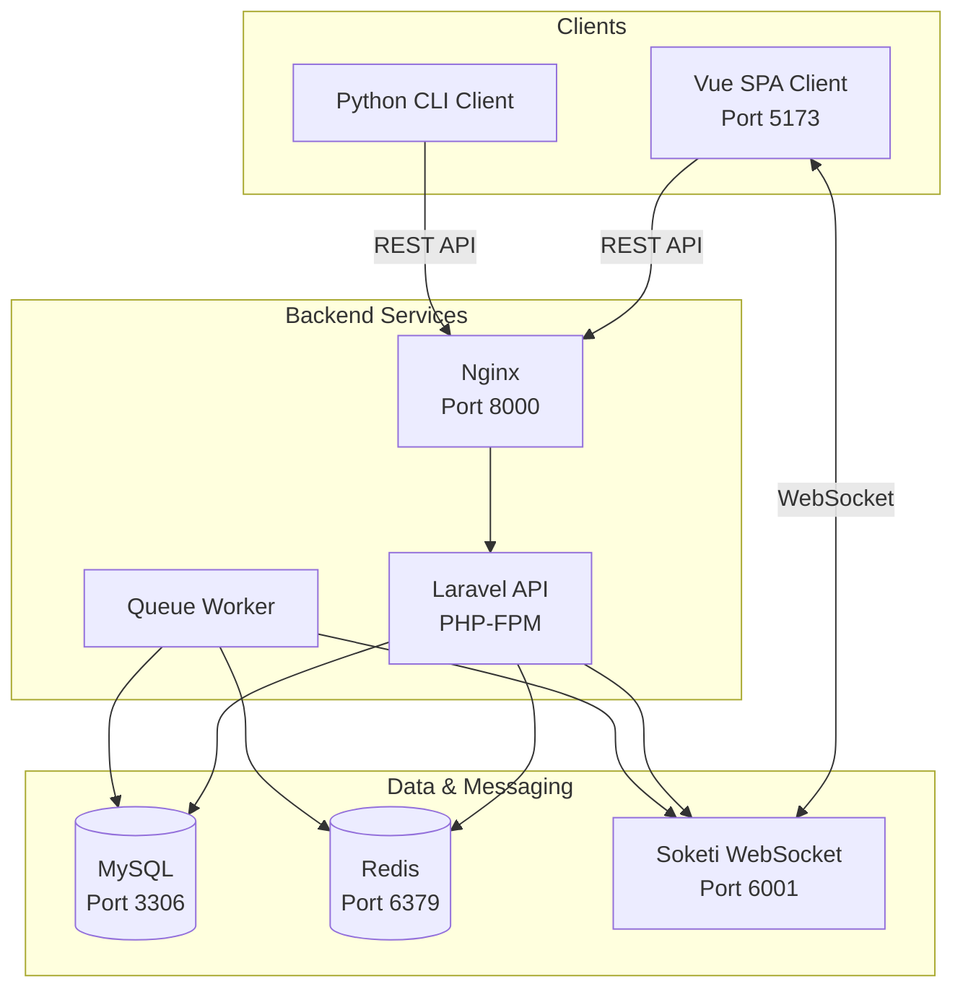

# Real-time Kanban Board

A distributed application with **Laravel API backend**, **Vue.js SPA frontend**, and **Python CLI client**, featuring hybrid synchronous and asynchronous communication.

## Architecture



## Hybrid Communication Model

### Synchronous Communication (REST API)

REST endpoints handle CRUD operations with immediate response:

- **Authentication**: Register, login, token refresh
- **Boards**: Create, read, update, delete boards
- **Tasks**: Create, read, update, delete tasks
- **Jobs**: Trigger exports, check job status

### Asynchronous Communication (WebSockets + Queue)

Real-time updates without polling:

- **Task Events**: `TaskCreated`, `TaskUpdated`, `TaskDeleted` broadcast to all clients viewing the board
- **Job Progress**: `JobStarted`, `JobProgress`, `JobCompleted`, `JobFailed` events for background export jobs
- **Private Channels**: Authenticated users subscribe to `board.{id}` and `user.{id}` channels

### Why Hybrid?

| Aspect | Synchronous (REST) | Asynchronous (WebSocket/Queue) |
|--------|-------------------|-------------------------------|
| Use Case | CRUD operations | Real-time updates |
| Guarantee | Immediate response | Eventually consistent |
| Complexity | Simple | Handles complex workflows |
| Scalability | Stateless | Pub/sub pattern |

## Quick Start

```bash
docker-compose up --build
```

Wait for setup to complete, then access:

- **Vue Frontend**: http://localhost:5173
- **API**: http://localhost:8000/api
- **WebSocket**: ws://localhost:6001

### Demo Credentials

- Email: `demo@example.com`
- Password: `password`

## API Reference

### Authentication

```bash
# Register
curl -X POST http://localhost:8000/api/auth/register \
  -H "Content-Type: application/json" \
  -d '{"name":"John","email":"john@example.com","password":"password123","password_confirmation":"password123"}'

# Login
curl -X POST http://localhost:8000/api/auth/login \
  -H "Content-Type: application/json" \
  -d '{"email":"demo@example.com","password":"password"}'

# Get current user
curl http://localhost:8000/api/auth/me \
  -H "Authorization: Bearer YOUR_TOKEN"

# Logout
curl -X POST http://localhost:8000/api/auth/logout \
  -H "Authorization: Bearer YOUR_TOKEN"
```

### Boards

```bash
# List boards
curl http://localhost:8000/api/boards \
  -H "Authorization: Bearer YOUR_TOKEN"

# Create board
curl -X POST http://localhost:8000/api/boards \
  -H "Authorization: Bearer YOUR_TOKEN" \
  -H "Content-Type: application/json" \
  -d '{"name":"My Board","description":"Board description"}'

# Get board
curl http://localhost:8000/api/boards/1 \
  -H "Authorization: Bearer YOUR_TOKEN"

# Update board
curl -X PATCH http://localhost:8000/api/boards/1 \
  -H "Authorization: Bearer YOUR_TOKEN" \
  -H "Content-Type: application/json" \
  -d '{"name":"Updated Name"}'

# Delete board
curl -X DELETE http://localhost:8000/api/boards/1 \
  -H "Authorization: Bearer YOUR_TOKEN"
```

### Tasks

```bash
# List tasks
curl http://localhost:8000/api/boards/1/tasks \
  -H "Authorization: Bearer YOUR_TOKEN"

# Create task
curl -X POST http://localhost:8000/api/boards/1/tasks \
  -H "Authorization: Bearer YOUR_TOKEN" \
  -H "Content-Type: application/json" \
  -d '{"title":"New Task","description":"Description","status":"todo"}'

# Update task
curl -X PATCH http://localhost:8000/api/boards/1/tasks/1 \
  -H "Authorization: Bearer YOUR_TOKEN" \
  -H "Content-Type: application/json" \
  -d '{"status":"in_progress"}'

# Delete task
curl -X DELETE http://localhost:8000/api/boards/1/tasks/1 \
  -H "Authorization: Bearer YOUR_TOKEN"
```

### Export Jobs

```bash
# Start export
curl -X POST http://localhost:8000/api/boards/1/export \
  -H "Authorization: Bearer YOUR_TOKEN"

# Check job status
curl http://localhost:8000/api/jobs/1 \
  -H "Authorization: Bearer YOUR_TOKEN"

# Download export (when completed)
curl http://localhost:8000/api/jobs/1/download \
  -H "Authorization: Bearer YOUR_TOKEN" \
  -o export.csv
```

## WebSocket Events

### Channels

- `private-board.{boardId}` - Board-specific events
- `private-user.{userId}` - User-specific events

### Event Payloads

```javascript
// TaskCreated
{
  "task": {
    "id": 1,
    "board_id": 1,
    "title": "New Task",
    "status": "todo"
  }
}

// TaskUpdated
{
  "task": {
    "id": 1,
    "board_id": 1,
    "title": "Updated Task",
    "status": "in_progress"
  }
}

// TaskDeleted
{
  "task": {
    "id": 1,
    "board_id": 1
  }
}

// JobProgress
{
  "job_id": 1,
  "board_id": 1,
  "progress": 50
}

// JobCompleted
{
  "job_id": 1,
  "board_id": 1,
  "status": "completed",
  "file_path": "exports/board_1_2024-01-01.csv"
}
```

## Vue Client

The Vue SPA provides:

- Login/Register forms
- Board list and management
- Kanban board with drag-less task status updates
- Real-time updates via WebSocket
- Export functionality with progress tracking

### Key Components

- `src/stores/auth.js` - Authentication state
- `src/stores/boards.js` - Board and task state
- `src/services/echo.js` - WebSocket connection
- `src/views/Board.vue` - Kanban board view

## Python CLI Client

```bash
cd python-client
pip install -r requirements.txt

# Set API URL (default: http://localhost:8000/api)
export API_URL=http://localhost:8000/api

# Login
python kanban_cli.py login

# List boards
python kanban_cli.py boards

# Show board
python kanban_cli.py board 1

# Create task
python kanban_cli.py create-task 1 --title "New Task" --status todo

# Move task
python kanban_cli.py move-task 1 1 in_progress

# Export board
python kanban_cli.py export 1
```

### Available Commands

| Command | Description |
|---------|-------------|
| `login` | Authenticate user |
| `register` | Create new account |
| `logout` | Clear authentication |
| `me` | Show current user |
| `boards` | List all boards |
| `board <id>` | Show board details |
| `create-board` | Create new board |
| `delete-board <id>` | Delete board |
| `tasks <board_id>` | List tasks |
| `create-task <board_id>` | Create task |
| `update-task <board_id> <task_id>` | Update task |
| `delete-task <board_id> <task_id>` | Delete task |
| `move-task <board_id> <task_id> <status>` | Change task status |
| `export <board_id>` | Start CSV export |
| `job-status <job_id>` | Check export status |

## Error Handling

All API errors return consistent JSON format:

```json
{
  "error": {
    "code": "VALIDATION_ERROR",
    "message": "Validation failed",
    "details": {
      "email": ["The email field is required."]
    }
  }
}
```

### HTTP Status Codes

| Code | Description |
|------|-------------|
| 200 | Success |
| 201 | Created |
| 204 | Deleted |
| 400 | Bad Request |
| 401 | Unauthenticated |
| 403 | Forbidden |
| 404 | Not Found |
| 422 | Validation Error |
| 500 | Server Error |

## Project Structure

```
├── app/
│   ├── Events/          # Broadcast events
│   ├── Http/
│   │   ├── Controllers/ # API controllers
│   │   └── Requests/    # Form validation
│   ├── Jobs/            # Queue jobs
│   └── Models/          # Eloquent models
├── database/
│   ├── factories/       # Model factories
│   ├── migrations/      # Database schema
│   └── seeders/         # Demo data
├── routes/
│   ├── api.php          # API routes
│   └── channels.php     # WebSocket channels
├── vue-client/          # Vue SPA
│   ├── src/
│   │   ├── components/  # Vue components
│   │   ├── views/       # Page views
│   │   ├── stores/      # Pinia stores
│   │   └── services/    # API & WebSocket
│   └── package.json
├── python-client/       # Python CLI
│   ├── kanban_cli.py
│   └── requirements.txt
├── docker/
│   └── nginx/           # Nginx config
├── docker-compose.yml
├── Dockerfile
└── README.md
```

## Libraries & Technologies

### Backend

| Library | Purpose |
|---------|---------|
| Laravel 12 | PHP framework |
| php-open-source-saver/jwt-auth | JWT authentication |
| predis/predis | Redis client |

### Frontend

| Library | Purpose |
|---------|---------|
| Vue 3 | UI framework |
| Pinia | State management |
| Vue Router | Client-side routing |
| Laravel Echo | WebSocket client |
| Pusher.js | WebSocket transport |
| Tailwind CSS | Styling |
| Axios | HTTP client |

### Python CLI

| Library | Purpose |
|---------|---------|
| Typer | CLI framework |
| Requests | HTTP client |
| Rich | Terminal formatting |

### Infrastructure

| Service | Purpose |
|---------|---------|
| Soketi | WebSocket server (Pusher-compatible) |
| Redis | Queue broker & cache |
| MySQL | Database |
| Nginx | Reverse proxy |

## Development

### Without Docker

```bash
# Backend
composer install
cp .env.docker .env
php artisan key:generate
php artisan jwt:secret
php artisan migrate --seed
php artisan serve

# Queue worker (separate terminal)
php artisan queue:work

# Frontend
cd vue-client
npm install
npm run dev
```

### Running Tests

```bash
composer test
```

